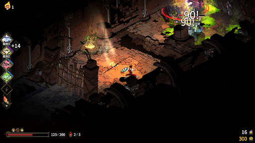
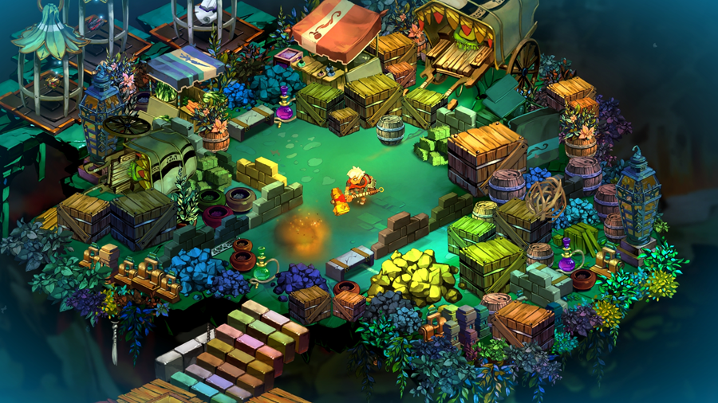
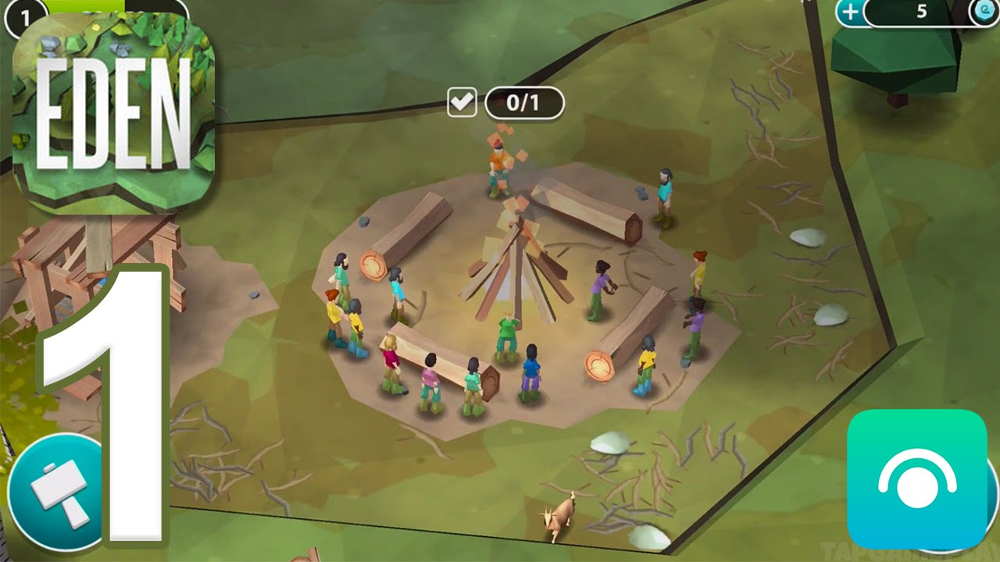

# **Evershore**

## **Team Members**

Liam Housenbold, Marcus King, Samuel Huang 

## **Game Summary**

Our project is a disguised survival horror game with a top-down isometric perspective. You find yourself on an island which seems like paradise, only to encounter horrors beyond your comprehension.  

## **Genres**

Horror, Low Poly, Isometric Top Down, Action, Narrative Heavy, 3D world 

## **Inspiration**

### **Hades**

Hades is an isometric top down game that’s heavily based on combat. While we won’t be taking combat from it directly, we will take its good environment and atmosphere for the horror section.

### **Bastion**

Similar to Hades, a simple but fun combat system from the top-down isometric perspective. Offers good inspiration for weapon mechanics. Heavy on story and multiple endings.

### **Eden** 

A top down mobile game involving building camps. We will take inspiration from its low poly aesthetic and “cozy” like vibes. 

## **Gameplay**

* Top down isometric player controller along with a camera system. Movement includes walk, sprint, roll, jump system.  
* Basic stealth system to sneak up on enemies when hunting during the day and to hide/avoid enemies during the night  
  * Sightline  
    * Can hide in bushes or behind rocks/trees  
    * Walking through water leaves a fading footprint trail  
  * Scent (nice to have feature)  
    * Longer in one place stronger radius of sphere  the smell  
    * Walking through river resets smell  
    * Wind direction indicated on Hud? Feature to be implemented if given time.  
  * Sound  
    * Stepping on branches makes noise  
    * Running/rolling is louder than walking  
    * Walking in water is louder  
    * entering/exiting a bush makes noise  
* Minimal verticality no more than height of the camera from the ground.  
* Hp systems “3 hearts” maybe item to gain another one   
  * Checkpoint rest to regain hp system no consumables/passive regen  
* Weapons system including up to 3 weapons (2 projectiles, 1 melee).   
* 3 basic enemies with navigational, detection and attack systems.   
  * Enemies are weak (taking 1-3 hits).  
  * Each enemy has their own attack sequence: a specific series of gameplay events in which you need to time your attacks so you can defeat/dodge the enemy. This sequence boils down to a decision tree.   
  * Enemy navigation is based on live environment information and enemy objective, possibly using Goal Oriented Action Programming.  
* A simple decision tree which influences ending sequence (3 endings, bad, default)  
* Linear level system with 3 combat encounters (stealth and fighting) end result of encounter influences ending tree.

## **Development Plan**

### **Project Checkpoint 1-2: Basic Mechanics and Scripting (Ch 5-9)**

Build isometric perspective, player controller, combat system, stealth, movement, health, attacks

Implement enemy navigation objective system and attack sequences. Set up sight and sound detection.

Implement individual scene decisions and lore of the endings.

Finish design sketch of all areas, characters, and items of the game.