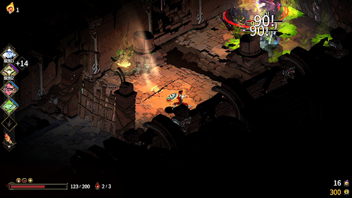
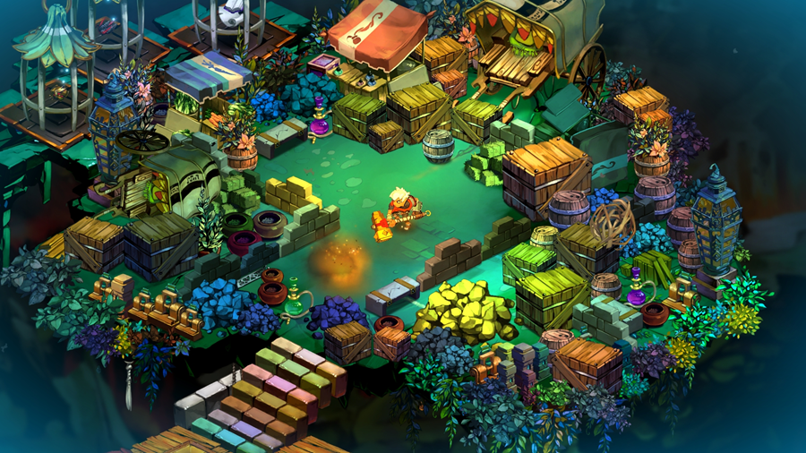
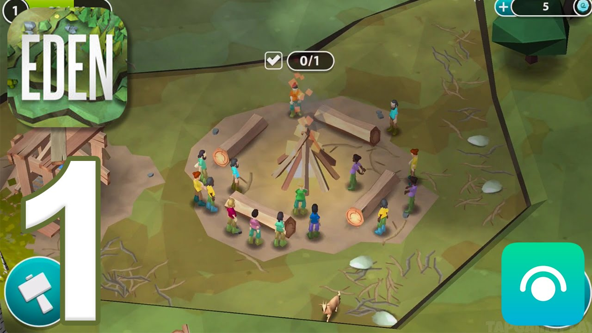
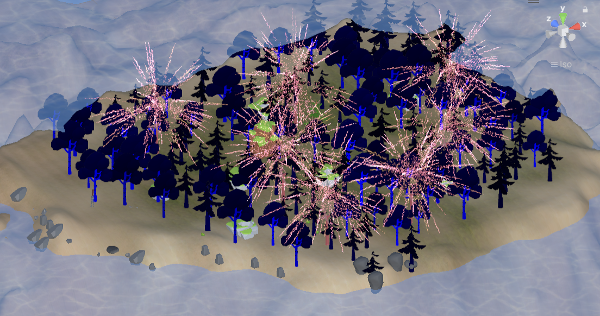
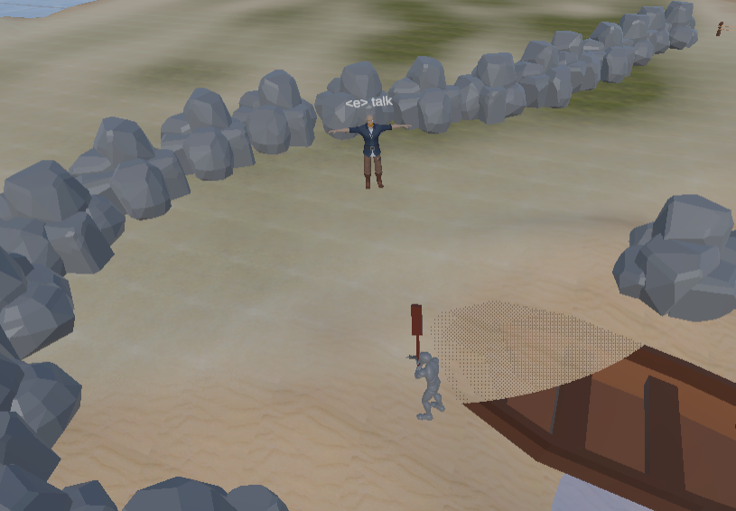
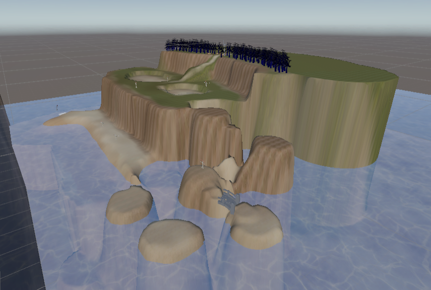
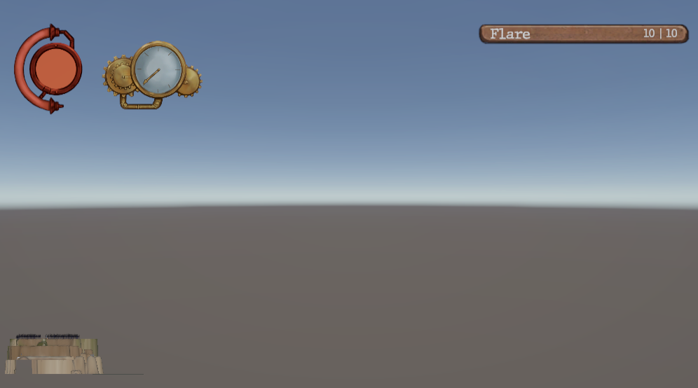
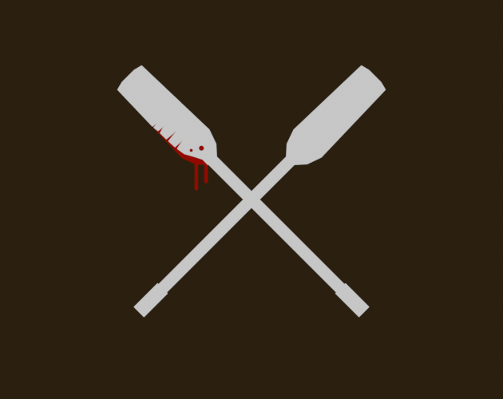

# **Evershore**

## **Team Members**

Liam Housenbold, Marcus King, Samuel Huang 

## **Game Summary**

Our project is a disguised survival horror game with a top-down isometric perspective. You find yourself on an archipelago which seems like paradise, only to encounter horrors beyond your comprehension.  

## **Genres**

Horror, Low Poly, Isometric Top Down, Action, Narrative Heavy, 3D world 

## **Inspiration**

### **Hades**

Hades is an isometric top down game that’s heavily based on combat. While we won’t be taking combat from it directly, we will take its good environment and atmosphere for the horror section.

### **Bastion**

Similar to Hades, a simple but fun combat system from the top-down isometric perspective. Offers good inspiration for weapon mechanics. Heavy on story and multiple endings.

### **Eden** 

A top down mobile game involving building camps. We will take inspiration from its low poly aesthetic and “cozy” like vibes. 

## **Gameplay**

* Top down isometric player controller along with a camera system. Movement includes walk, sprint, roll, jump system.  
* Basic stealth system to sneak up on enemies when hunting during the day and to hide/avoid enemies during the night  
  * Sightline  
    * Can hide in bushes or behind rocks/trees  
    * Walking through water leaves a fading footprint trail  
  * Scent (nice to have feature)  
    * Longer in one place stronger radius of sphere  the smell  
    * Walking through river resets smell  
    * Wind direction indicated on Hud? Feature to be implemented if given time.  
  * Sound  
    * Stepping on branches makes noise  
    * Running/rolling is louder than walking  
    * Walking in water is louder  
    * entering/exiting a bush makes noise  
* Minimal verticality no more than height of the camera from the ground.  
* Hp systems “3 hearts” maybe item to gain another one   
  * Checkpoint rest to regain hp system no consumables/passive regen  
* Weapons system including up to 3 weapons (2 projectiles, 1 melee).   
* 3 basic enemies with navigational, detection and attack systems.   
  * Enemies are weak (taking 1-3 hits).  
  * Each enemy has their own attack sequence: a specific series of gameplay events in which you need to time your attacks so you can defeat/dodge the enemy. This sequence boils down to a decision tree.   
  * Enemy navigation is based on live environment information and enemy objective, possibly using Goal Oriented Action Programming.  
* A simple decision tree which influences ending sequence (3 endings, bad, default)  
* Linear level system with 3 combat encounters (stealth and fighting) end result of encounter influences ending tree.

## **Development Plan**  
   
### **Project Checkpoint 1: Basic Mechanics and Scripting (Ch 5-9)**  
#### **SAM**  
- ~~\-Finish design sketch of all areas, characters, and items of the game.~~  
\-Implement individual scene decisions and lore of the endings.  
*“We did not get to the ending portion. We invested our time in gameplay resources. We needed to make a gameplay loop first so the ending could be reached we now realize after getting started that adding the ending text scene will be the last thing we do after all the other gameplay and impacting decisions are implemented”*
#### **MARCUS**
- \-~~Build isometric perspective~~, ~~player controller~~, ~~combat system~~, stealth, ~~movement~~, ~~health~~, ~~attacks~~  
*“We were not able to complete the stealth system due to  time constraints. The combat system took longer to implement than expected.”*
#### **LIAM**  
- ~~\-Implement enemy navigation objective system and attack sequences. Set up sight and sound detection.~~  
*“The enemy works on a range detection, not a sound detection system”*

*Additions:*  
*~~We were able to make a scene transition script to move between scenes~~*  
*~~We were also able to make a GameManager Script to transition to the loss screen on player death and the win screen on puzzle completion~~*

### **Checkpoint 2**  
#### **Player Prefab Updates (Marcus)**  
- ~~\-Clean up and document player code~~   
- ~~\-Add updates from last submission to README~~   
- ~~\-Add rigidbody to player controller~~   
- ~~\-Document how to use the player controller and attack system in README~~   
- ~~\-Configure to work with scene transition using player tag~~   
- ~~\-Win loss conditions~~   
- ~~\-Find or make a static player model and cite~~ 

Nice to have Additions:  
\-update oar Collison and add flare gun(requires charge up mechanic to be added)  
\-Add basic animator to player  
“Both of these are partially implemented and in progress for the next checkpoint”

#### **Enemy Updates (Liam)**  
- ~~\-Clean up and document enemy code~~  
- ~~\-add updates from last submission to README~~  
- ~~\-add 3rd attack to enemy (diagonal swing)~~  
- ~~\-add model/texture to enemy prefab~~  
- ~~\-add model animations to enemy prefab?~~  
- ~~\-Document how the enemies work in README~~  
- ~~\-add collider bounds gizmo to enemy/weapon hitboxes~~  
- ~~Add enemy island with island terrain texture~~  
- ~~Create water shader for water effect for scenes~~

Nice to have Additions:  
\-Ranged enemy version  
\-Enemy visual HP bar  
“Didnt get to these extra steps but am planning on adding the HP bars this weekend and I made a lot of bonus progress on the enemy animations”

#### **Map/town updates: (Samuel)**  
- ~~\-Comment and add documentation to previous code~~  
- ~~\-Populate town with assets~~  
- ~~\-add boat assets and fix scene transition~~  
- ~~\-add puzzle island and town island~~   
- ~~\-Update puzzle with windmill assets~~  
- ~~\-Add villager models~~  
- ~~\-Add textbox dialogue system with villagers on interact~~

### Checkpoint 3: (Chapters 11, 12, and 13)

#### **SAM:**

- ~~\-Add scene Illumination w/ day-night cycle (lighting and shadows)~~  
- ~~\-Apply post-processing effects to highlight tonal shifts as the game becomes more sinister.~~  
- ~~\-Finalize level design~~  
- ~~\-Add ending scene with typewriter effect~~  
- ~~\-Add basic ending scene~~  
\-Add second Puzzle

Possible nice to have:  
\-Add respawn/replay button to win and lose screens  
\- Experiment with increasing the player’s scale to match the proportions of other scene elements.

#### **MARCUS:**

\-Finish Player weapon Animations  
*“This has been pushed to the next submission due to complexity. I have discussed this system with Shawn and made an outline on paper. I am currently in the preliminary stages of implementing this on a feature branch”*  
- ~~\-Update Player movement Animations~~  
- ~~\-Make materials transparent when the player moves behind objects, particularly in the puzzle test scene, to improve visibility.~~  
- ~~\-Add player HP bars~~  
- ~~\-Add blood particle effect on weapon hit~~  
- ~~\-Add dust trail effect on sprint~~

Possible nice to have:
- \-Continue developing the stealth mechanic; start with a simple change such as reducing enemy detection range while the player is moving.

#### **LIAM:**

~~\-Add ranged enemies~~  
~~\-enemy HP bar~~  
~~\-Add particle effect to ranged projectile~~  
\-Standardize scene hierarchy organization

Nice to have:

- ~~Add particle effects to enhance~~ the bonfire and ~~combat interactions.~~  
- Refine lighting to make scenes more dynamic and to give each area a distinct atmosphere.

### Checkpoint 4: (Chapters 14, 15, and 17)
#### **SAM:**
- ~~Add death screen prefab that appears on player death event (main menu, restart scene)~~
- ~~Add main menu that allows access to all scenes (no options, just play -> select scene)~~
- ~~Animate environmental elements such as grass or trees to add life to the scene.~~
- ~~Implement sound effects and music, with the soundtrack gradually becoming creepier as the game progresses.~~

#### **MARCUS:**
- ~~Make the dithering shader effect slightly less intense.~~ 
- ~~Update in-game healthbar~~ 
- ~~Finish Player weapon Animations~~ 
- ~~Update Oar attack system~~
- ~~Add second weapon~~
- ~~Add weapon UI display~~
- ~~Player Audio (footsteps, hurt, attack)~~

#### **LIAM:**
- ~~Fix the skeleton walking animation, which currently looks like sliding/skating.~~
- ~~Fix the throwing animation for the ranged enemy.~~
- ~~Fix animation conflicts with multiple enemies at same time.~~
- ~~Add enemy audio(footsteps, attack, defense, shoot, charge)~~
- ~~Continue developing the stealth mechanic; start with a simple change such as reducing enemy detection range while the player is moving.~~

### Checkpoint 5: (Final Update)
#### SAM:

- ~~Complete a fully playable start-to-finish game loop, including all planned levels and a final win condition, and ensure players can return to the beginning.~~

*All scenes are now linked with proper transitions.*

- ~~Start connecting the endings you have to the main gameplay. The difference between endings doesn't have to require substantially different choices made in gameplay.~~
- ~~Check that game is fully reset on ending scene, so that the player can continue post the ending~~   
- ~~Fix day/night cycle speed glitch on one of the scenes~~   
- ~~Remove the quit button from the web build,~~
- ~~update itch.io page to look nicer~~   

#### MARCUS: 
- ~~Add Tutorial level~~

*Tutorial level featuring a new NPC.*

- ~~Add combat level (enemyLevel1)~~

*EnemyLevel1 experiments with how vertical level design integrates in our game.*

- ~~Polish the combat and menu UI~~

*New UI Design gives old-timey look to Evershore*

- ~~Start preparing a WebGL build and test it early to catch any WebGL specific issues since that will be required for the next submission~~  
- ~~Unlock cursor in main menu screen~~  
- Add at least two additional juicing elements  
  - Camera Shake  
    “Given the amount of work we needed to do to develop horizontally, this was out of scope. This submission was focused on putting everything together and fixing bugs.”  
  - ~~Fixed blood dripper effect~~
- ~~download with a link to an updated itch.io page~~   
- ~~Update readme to be current and add a future work section.~~  
- ~~Gather playtesting feedback~~  
- ~~Created logo~~

- ~~Made and imported custom oar 3d model~~

*Oar model made in Blender. Expirmenting with a bevel mask and color ramp to highlight edges*

- ~~Fix tree collision and awkward level layout in final hub.~~
- ~~Add water kill volume to the tutorial.~~  
- ~~Improve performance in grass heavy forest scene~~   
- ~~Make the font more readable in the "Shawn says" screen, update the color of the text to be more visible in the background.~~  
- ~~Update placeholder dialogue UI so that images are not stretched and blurry~~  
- ~~Fix NPC scaling so they are no longer giants.~~  
- ~~Add dithering shader into forest scene~~
- ~~update web build version on itch page~~
- ~~Add 3d scene backrounds to all endings and menu that update with player choices~~
#### LIAM:

- ~~Reduce noise of throwing effect~~  
- ~~Update enemy sounds and add death sound/particle/animation fixes~~  
- ~~Have the sword not damage the player when not being used by enemy~~  
- ~~Do one of the combat levels~~  
- ~~Add enemy death counter that persists and connect it to the lull ending~~
- ~~Add delay and visual transition before scene transition so sound effects don't get cut~~   
- ~~Add UI background for endings~~  
- ~~Fix all audio to be same volume~~
- ~~screen capture recording of a demo playthrough~~
- ~~Fix enemy death audio~~  
- ~~Added safety platforms below boats so you don't fall through and die when transitioning between scenes~~

## Future Work:
After getting feedback from playtesters, the following features are most important to add next.
- Levels need indication when they are completed (boats should disappear)
- Add a way of  indicating there is a way to get a good ending (ending 1 of 3, etc.)
- Candle level needs some explanation on how to start it
- Indicate that killing enemies has a consequence for the story (sea turns bloody)
- Hub village should update when you complete a level to show that villagers are preparing for a festival.
- Have villagers mention the skeletons so they make sense in the story
- The endings are not very rewarding for players. If the player leaves quietly, the text should be supplemented with a battle on the boat before it gets captured. If the player alerts the villagers, have a similar sequence in the hub level
- If the player kills all the skeletons, unlock a weapon which allows the player to get the massacre ending.

#### MARCUS CONTINUED WORK (12/25)
- Update logo to be thicker
- Used screen space center vector aiming system to replace the raycast intersection aiming
- Add a procedural bullet trail that scale with weapon rage and uses object pooling for better preformance
- Add M240 Machine gun
- Tweak combat weapon values
- Add "heavy" weapon type where player cannot sprint while holding
- Overhaul the weapon widget system to dynamically scale with number of weapons

## Game Demo:
Note that for the last 2 endings of this demo I used cheat codes to instantly finish the puzzles rather than spending the 15 extra minutes to play through the 4 scenes twice more over again each.
[Watch the gameplay demo](https://www.youtube.com/watch?v=Ond1yq2edJM)

## **Instructions for Testing the Project:**  
Please browse through all scenes in "Scenes/Final Submission" folder. Load these scenes in the sequence defined above. Change parameters in puzzle completion flags of the endmanager in the finalhub scene to get different endings

Player:

- WASD controls. Point player in the direction of your cursor. Q previous weapon, E next weapon. Left click to attack. Space to jump, shift to sprint. Scroll Q/E for next/previous weapon.

\-The Hub map has a marketplace, houses, and three NPCs. I have implemented a simple dialogue system where you can talk to the NPC by pressing 'E', and the dialogue UI will show up. 

\-Enemies have a few states(can be found in detail in the EnemyFSM script)   
\-it has an out of combat patrol state that enters combat upon the player entering its view angle unobstructed (shown by the red gizmo)   
\-It has a charge attack that speeds up the enemy in the player direction when the enemy is in combat and far away (range shown by the yellow gizmo)  
	\-It has chase player state that follows the player  
	\-It has swing attack that swipes the skeleton sword at the player (swipe attack range shown by the green gizmo) (weapon hitbox is also outlined by a gizmo)  
	\-It has a defensive stance state where the enemy will glow red and get increased armor(take reduced damage for a few seconds) \[future TODO: add reflective thorns damage if the player hits the enemy while they are in this stance\]

**Assets  used:** https://assetstore.unity.com/packages/3d/characters/humanoids/low-poly-medieval-characters-lite-316247  
https://assetstore.unity.com/packages/3d/environments/wooden-house-free-low-poly-270889  
https://assetstore.unity.com/packages/vfx/particles/fire-explosions/low-poly-fire-244190  
https://assetstore.unity.com/packages/3d/environments/low-poly-tropical-island-lite-242437  
https://assetstore.unity.com/packages/3d/environments/landscapes/low-poly-simple-nature-pack-162153  
https://assetstore.unity.com/packages/3d/environments/simplepoly-city-low-poly-assets-58899  
[https://assetstore.unity.com/packages/3d/environments/landscapes/low-poly-atmospheric-locations-pack-278928](https://assetstore.unity.com/packages/3d/environments/landscapes/low-poly-atmospheric-locations-pack-278928)  
[https://assetstore.unity.com/packages/3d/animations/skeleton-animations-free-217504\#description](https://assetstore.unity.com/packages/3d/animations/skeleton-animations-free-217504#description)  
[https://assetstore.unity.com/packages/3d/characters/humanoids/humans/human-character-dummy-178395](https://assetstore.unity.com/packages/3d/characters/humanoids/humans/human-character-dummy-178395), [https://assetstore.unity.com/packages/3d/animations/human-melee-animations-free-165785](https://assetstore.unity.com/packages/3d/animations/human-melee-animations-free-165785), [https://gamedevbeginner.com/singletons-in-unity-the-right-way/](https://gamedevbeginner.com/singletons-in-unity-the-right-way/), [https://github.com/roboryantron/Unite2017](https://github.com/roboryantron/Unite2017)  
All material/texture/noise pngs from are from https://www.freepik.com
https://www.youtube.com/watch?v=aRU-CWP0yOo

